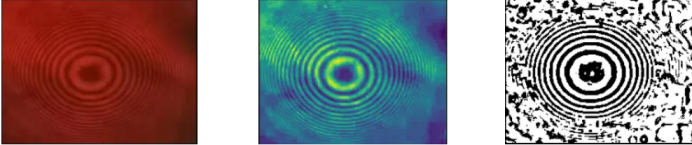

# 等倾条纹计数系统的搭建

## 目录

1.[视频切帧处理](#视频切帧处理)

2.[Motion滤波器增强图像](#Motion滤波器增强图像)

3.[自适应阈值算法二值化](#自适应阈值算法二值化)

4.[图像计数程序](#图像计数程序)

5.[qt5界面设计](#qt5界面设计)

## 视频切帧处理

直接利用opencv对视频文件切帧，但要注意拍摄的等倾条纹一定居中且曝光均匀，否则不利于后续图像处理和计数。

## Motion滤波器增强图像

```python
def filter_imgs(gray_img):
    # 尝试一下不同的核的效果
    Emboss = np.array([[ -2,-1, 0],
                       [ -1, 1, 1],
                       [  0, 1, 2]])

    Motion = np.array([[ 0.333, 0,  0],
                       [  0, 0.333, 0],
                       [  0, 0, 0.333]])

    Emboss_img = cv2.filter2D(gray_img,cv2.CV_16S,Emboss)
    Motion_img = cv2.filter2D(gray_img, cv2.CV_16S, Motion)
    Emboss_img = cv2.convertScaleAbs(Emboss_img)
    Motion_img = cv2.convertScaleAbs(Motion_img)

    different_V = np.array([[  0, -1, 0],
                            [  0,  1, 0],
                            [  0,  0, 0]])
    different_H = np.array([[  0, 0, 0],
                            [ -1, 1, 0],
                            [  0, 0, 0]])
    different_temp = cv2.filter2D(gray_img,cv2.CV_16S,different_V)
    different_temp = cv2.filter2D(different_temp, cv2.CV_16S, different_H)
    different_img = cv2.convertScaleAbs(different_temp)

    Sobel_V = np.array([[ 1,  2,  1],
                        [ 0,  0,  0],
                        [ -1, -2, -1]])
    Sobel_H = np.array([[ 1,  0, -1],
                        [ 2,  0, -2],
                        [ 1,  0, -1]])
    Sobel_temp = cv2.filter2D(gray_img,cv2.CV_16S, Sobel_V)
    Sobel_temp = cv2.filter2D(Sobel_temp, cv2.CV_16S, Sobel_H)
    Sobel_img = cv2.convertScaleAbs(Sobel_temp)


    Prewitt_V = np.array([[-1, -1, -1],
                          [ 0,  0,  0],
                          [ 1,  1,  1]])
    Prewitt_H = np.array([[-1,  0, 1],
                          [-1,  0, 1],
                          [-1,  0, 1]])
    Prewitt_temp = cv2.filter2D(gray_img, cv2.CV_16S, Prewitt_V)
    Prewitt_temp = cv2.filter2D(Prewitt_temp, cv2.CV_16S, Prewitt_H)
    Prewitt_img = cv2.convertScaleAbs(Prewitt_temp)

    kernel_P = np.array([[0,  0, -1,  0, 0],
                         [0, -1, -2, -1, 0],
                         [-1,-2, 16, -2,-1],
                         [0, -1, -2, -1, 0],
                         [0, 0,  -1, 0,  0]])
    kernel_N = np.array([[0, 0,  1,  0, 0],
                         [0, 1,  2,  1, 0],
                         [1, 2, -16, 2, 1],
                         [0, 1,  2,  1, 0],
                         [0, 0,  1,  0, 0]])


    lap4_filter = np.array([[0, 1, 0],
                            [1, -4, 1],
                            [0, 1, 0]])  # 4邻域laplacian算子
    lap8_filter = np.array([[0, 1, 0],
                            [1, -8, 1],
                            [0, 1, 0]])  # 8邻域laplacian算子
    lap_filter_P = cv2.filter2D(gray_img, cv2.CV_16S, kernel_P)
    edge4_img_P = cv2.filter2D(lap_filter_P, cv2.CV_16S, lap4_filter)
    edge4_img_P = cv2.convertScaleAbs(edge4_img_P)

    edge8_img_P = cv2.filter2D(lap_filter_P, cv2.CV_16S, lap8_filter)
    edge8_img_P = cv2.convertScaleAbs(edge8_img_P)


    lap_filter_N = cv2.filter2D(gray_img, cv2.CV_16S, kernel_N)
    edge4_img_N = cv2.filter2D(lap_filter_N, cv2.CV_16S, lap4_filter)
    edge4_img_N = cv2.convertScaleAbs(edge4_img_N)

    edge8_img_N = cv2.filter2D(lap_filter_N, cv2.CV_16S, lap8_filter)
    edge8_img_N = cv2.convertScaleAbs(edge8_img_N)
    return (Emboss_img,Motion_img,different_img,Sobel_img,Prewitt_img,edge4_img_P,edge8_img_P,edge4_img_N,edge8_img_N)
```


详细讲解请参见：[(66条消息) OpenCV—Python 图像滤波（均值、中值、高斯、高斯双边、高通等滤波）_wsp_1138886114的博客-CSDN博客_python 图像均值滤波](https://blog.csdn.net/wsp_1138886114/article/details/82872838)

## 自适应阈值算法二值化

由于二值图像数据足够简单，许多视觉算法都依赖二值图像。通过二值图像，能更好地分析物体的形状和轮廓。二值图像也常常用作原始图像的**掩模（又称遮罩、蒙版，Mask）**：它就像一张部分镂空的纸，把我们不感兴趣的区域遮掉。进行二值化有多种方式，其中最常用的就是采用**阈值法（Thresholding）**进行二值化。

实验效果请见下图：



详细讲解请参见：[自适应阈值二值化算法 - bldong - 博客园 (cnblogs.com)](https://www.cnblogs.com/polly333/p/7269153.html)

## 图像计数程序

```py
import os
import cv2
import numpy as np
import matplotlib.pyplot as plt
i=1
list=[]
pic_path = "./JPEGImages/"   # 图片路径
for file in os.listdir(pic_path):
   file_name = pic_path + str(i)+".jpg"
   #print(file_name)
   i=i+1
   img = cv2.imread(file_name)
   img1=img[555, 715]#本实验采用取八个像素点再取平均值的方法
   list.append(img1[0])

X=np.linspace(1, 129, num=129) # X轴坐标数据
plt.plot(X,list)            # 绘制曲线图
```


## qt5界面设计

